# FancyBBS
# 引言
## 编写本文目的
本项目为BBS论坛系统，书写此文档是为了确定用户对本系统的真正需求，确定一份完整、准确、清晰、具体的系统要求及设计方案，从而有效地帮助开发人员实现此系统的各个模块和各项功能，也让用户对此系统有更全面的了解。
此文档包含了用户对系统的具体要求，系统的功能需求等；可作为用户需求的确定书和总体设计的依据，也是验证和维护系统的依据。
## 项目背景
本项目为BBS论坛系统，书写此文档是为了确定用户对本系统的真正需求，确定一份完整、准确、清晰、具体的系统要求及设计方案，从而有效地帮助开发人员实现此系统的各个模块和各项功能，也让用户对此系统有更全面的了解。
此文档包含了用户对系统的具体要求，系统的功能需求等；可作为用户需求的确定书和总体设计的依据，也是验证和维护系统的依据。

# FancyBBS-BBS论坛介绍
## 特征
- 用户可自定义用户名、密码、密码
- 可以发新信息（新帖）、回复（跟随）等
- 用户可以在论坛内部相互发送短消息，系统自动提示未读短消息
- 管理员可以发布各类论坛公告，最新公告以滚动条的形式出现在论坛最上方
- 管理员可自由设定分论坛的主题，可同时设置多个论坛，每个分论坛都具有定时开通功能。可为每个分论坛配置版主（分论坛管理员）
- 所有的网友发言信息必须经过管理员审核通过才能发布，提供“控制开关”，即如果审核通过，点“通过”按钮即可，需要删除的点“删除”按钮即可
- 可以根据发帖的主题、内容关键字、作者、分论坛等信息搜索论坛内已有的文章
- 管理员可控制论坛的开通和关闭，可设定关闭后不可再发帖或不可再访问
- 系统可自动检测在线用户IP地址、操作系统、浏览器版本并可显示所有在线用户
- 根据注册用户填写的注册信息，在用户生日到来时自动提醒
- 自动统计在线用户数并列表显示在线用户；自动统计用户的发帖数、跟帖数（回复数）、访问次数和点击量
## 用户特征
| 用户类|    |    说明 |
| :--------: | :--------:|
| 游客  | 只能看帖 |
| 注册会员     |  用户是面向所有的网友，他们希望有用一个公众就关心的重大问题和疑难问题交流的平台。网友可以从网吧，办公司，家里上网来论坛交流讨论。用户希望能在论坛注册，发帖，发送短消息，论坛检索等功能。 |
| 一般管理员      |    管理员在论坛中主要负责发布各种论坛公告，设定安全过滤，审核网友发言信息，定时开通论坛 |
## 功能
- “注册”用例：用户可自定义个人信息
- “登陆”用力：会员可以登陆系统
- “发帖回复”用例：会员可以发新信息，回复等，可以发起投票统计并自动统计调查结果，可提供图形化显示功能
- “发送短消息”用例：用户可以在论坛内部相互发送短消息，系统自动提示未读短消息
- “内容安全过滤”用例：系统对网友的发言进行过滤，系统对报警的信息自动添加特别记号重点标明
- “论坛检索”用例：用户可以搜索论坛内已有的文章
- “用户检索”用例：系统可自动检测在线用户IP地址、操作系统、浏览器版本并可显示所有在线用户
- “生日提醒”用例：系统在用户生日到来时自动提醒
- “发布公告”用例：管理员可以发布各类论坛公
- “设定分论坛”用例：管理员可自由设定分论坛的主题，可同时设置多个论坛每个分论坛都具有定时开通功能。可为每个分论坛配置版主
- “审查信息”用例：所有的网友发言信息必须经过管理员审核通过才能发布
- “定时开通论坛”用例：管理员可控制论坛的开通和关闭，可设定关闭后不可再发帖或不可再访问
- “论坛在线统计”用例：自动统计在线用户数并列表显示在线用户；自动统计用户的发帖数、跟帖数、访问次数和点击量
## 开发环境
- MyEclipse 10
- MySql 5.0
- jdk 1.6
- Win 10
- Tomcat 6.0
- IBM Rational Rose Enterprise Edition
- PowerDesigner
- GBK编码
## 部署说明
- 数据库配置在
`src/Configuration.java`
- 数据库构造文件
`doc/database/init/fancybbs.sql`
- 数据库构造及数据文件
`doc/database/fancybbs-date.sql`
- 超级管理员
默认用户名：`admin`密码：`admin`
*必须连接数据库才可启动部署项目，默认用户名`root`，密码`123456`*

# 需求分析
## 功能需求
系统大致可以分为两个组成部分：
面向管理员的论坛管理系统和面向所有用户的论坛服务系统。
如前所述，在我们的系统中，BBS一般是以web方式登录。因而，无论是管理员方还是用户方都不必安装该系统。但是，为了解释网页代码中的服务器端脚本语言代码，服务器端必须安装相应的web服务器（比如Apache，IIS），脚本代码解释引擎(比如Apache Tomcat（推荐）)和数据库服务器（如SQL Server）。所有用户都通过密码验证后登录论坛管理系统，进行相应的后台管理如用户管理，讨论区管理和文章管理。
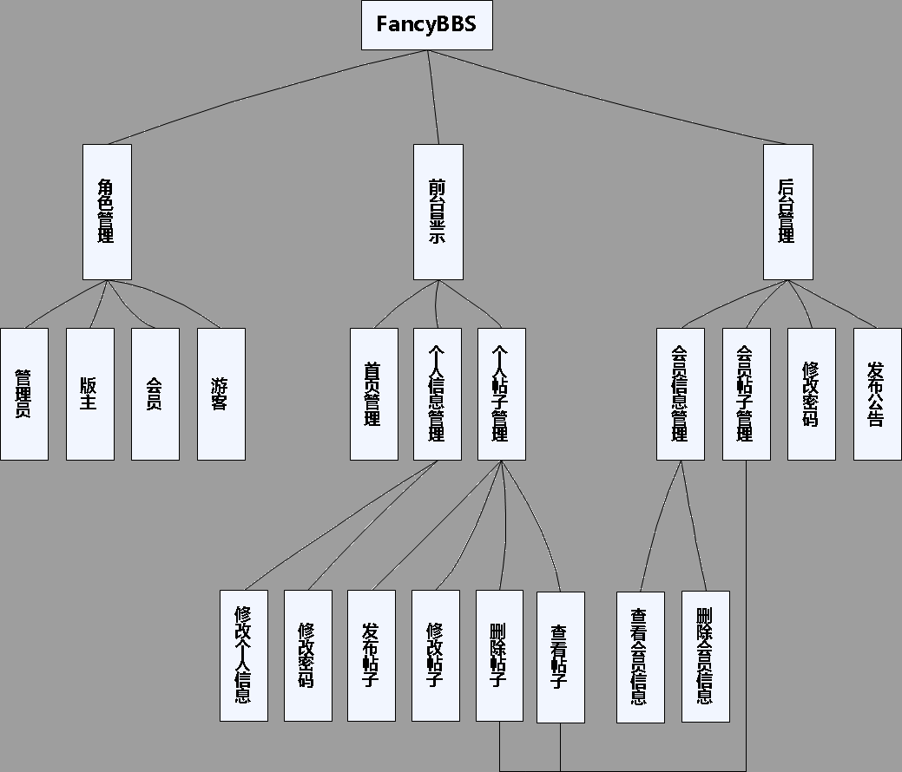
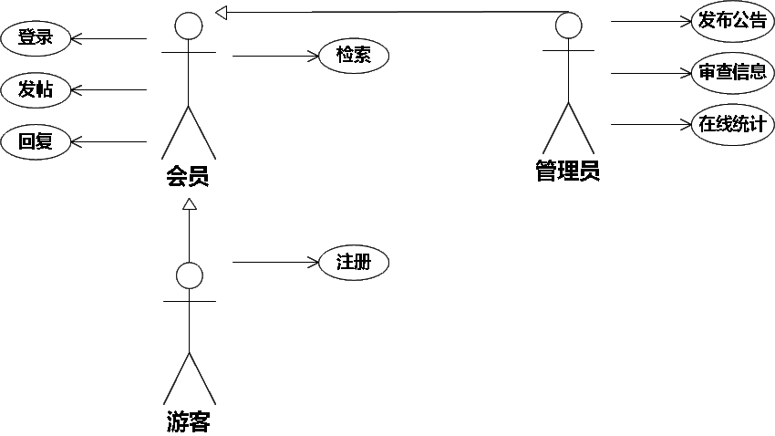
### 关于用户的权限功能的需求
论坛系统应该能够在用户通过帐户密码验证登录论坛服务系统后，判断用户级别识别四类不同权限级别的用户。
第一类是游客，拥有浏览文章，查询注册用户个体最基本信息的权限；
第二类是一般用户，能够在论坛讨论区发表/浏览/回复主题，管理个人信息等；
第三类是管理员，能够对相应主题进行删除/精华，对回复的帖子进行删除，封锁ID以及解除对一般用户的封锁；
第四类是主管理员，拥有最高权限，能够在管理员的权限的基础上增加：管理员权限更改。详细的用户权限起始流程如图
说明：
- 所有服务请求都有需要验证用户权限的级别，即x（usergrade）的值（0，1，2，3（游客为3））；比如：回复主题的权限是x=0，1或者2。比如：精华文章的权限要求为x=0或2。
- 管理员增加的是一个《管理》模块。
### 数据流图与数据加工
下面以“找回密码/更改密码，发表/置顶主题，删除帖子，赋予/取消用户管理员权限，”等请求为例，作出具体的数据流图，以示说明：
功能1：接收用户的发表/置顶主题，删除帖子等请求（用户ID、用户信息、目标序号、附带内容或信息），根据用户ID查询用户表以检验用户是否具有对应权限，如有则将发文请求信息送到对应的处理程序，进一步处理，如无则向用户提示出错；
功能2：查询数据库，根据发表/设精华文章，删除帖子等请求（用户ID、用户信息、目标序号、附带内容或信息）产生updata，insert，select等语句更改或删除数据，同时修改连接的表的部分数据；
## 数据需求
根据系统的数据流图和数据加工说明，编撰系统的数据结构：
### 概念结构设计
根据对系统的需求分析结果，我们设计部分E-R图如下：
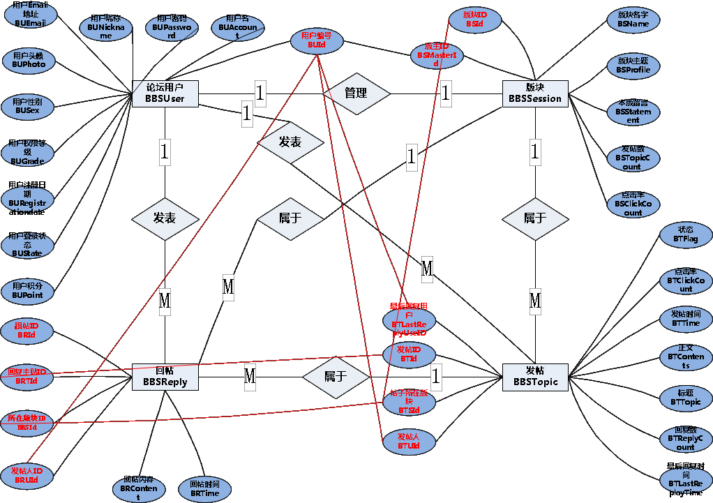
### 逻辑设计
我们初步将E-R图转换成关系模型如下（超简单版）：
用户（用户id,用户名,密码,真名,地址,性别,生日,qq,昵称,注册日期,发文总数,用户权限级别,个性签名）
文章（文章编号,发文人的用户id,（用户名,用户个性签名（此两项通过用户id在用户表中读取））访问人数, 回复人数,文章名,文章内容,发文日期）

## 系统的菜单设计
如前所述，BBS论坛系统提供的是web方式登录，即系统用户上网， 并用IE访问BBS论坛系统，我们的论坛系统的菜单是以网页链接的方式出现的，因而，它不是一般软件的菜单有着严格的层次结构。我们将系统的菜单结构描述如下：  
### 服务系统的菜单设计
在服务系统主页的登录界面应该有三个菜单按钮：登陆（登陆后位：更改信息）、注册、匿名、管理（需管理员权限时显示）。他们分别将指系统的不同功能页面。
“登录”指向一个需要权限审核的系统服务界面，“注册”将会带用户到一个新用户注册界面，我们以“登录”为二级菜单，在进入主页后可进入登陆或注册界面，登陆后菜单按照系统功能分为5栏二级菜单：个人信息、主页浏览、搜索、退出、管理菜单。
“个人信息”之下可以根据需要或者是用户方便设置第三级菜单，一般包括一下几项：(1)个人资料浏览；(2) 密码修改；(3)个人资料修改；管理系统的二级菜单按照其应该完成的功能分为一下几项：
- 管理员权限授予/回收；（在文字框中输入该用户id后，点‘确认’）
- 删除用户（在文字框中输入该用户id后，点‘确认’）
- 个人资料浏览
- 个人资料修改
管理系统的一级菜单每一项完成一个特定的功能，所以不再需要设计二级菜单。
实际上，因为网页链接存在环行结构，所以在某些四级级菜单中会出现某些三级级菜单名，这也正是BBS系统的菜单结构层次不严谨的缘故。

## UML设计
### 用例图
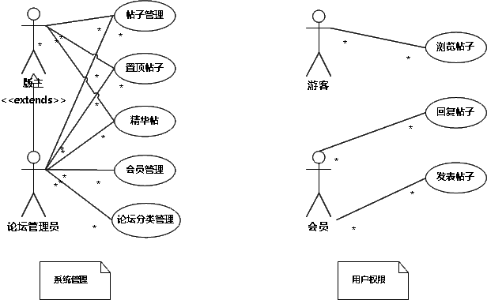
### 顺序图
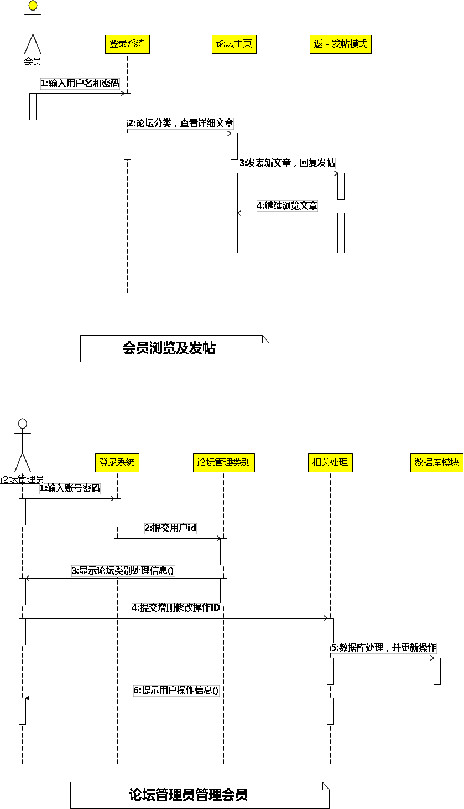
### 状态图
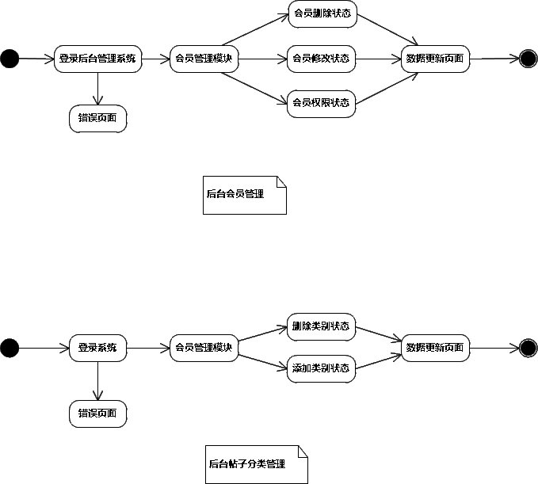
### 数据库概要

# 接口设计
## 用户接口
图形用户界面：
- 注册界面：输入储户信息，按确定提交内容。 2.登录界面：输入已经注册的用户名，成为正式会员。
- 浏览界面：游客和会员都有权浏览其他用户或者管理员所发表的文章。
- 发帖界面:会员有权发表帖子。对其他用户所发帖子有权进行评论。
- 修改界面：会员有权对自己的个人信息进行修改。
- 管理员信息修改：超级管理员及特定的管理员具有此权限，可以删除会员信息，删除所发的不良消息的帖子和评论。
## 结构接口
###文本框编辑器
`fckeditor`
FCKeditor是目前最优秀的可见即可得网页编辑器之一，它采用JavaScript编写。具备功能强大、配置容易、跨浏览器、支持多种编程语言、开源等特点。它非常流行，互联网上很容易找到相关技术文档，国内许多WEB项目和大型网站均采用了FCKeditor（如百度，阿里巴巴）。本文将通过与PHP相结合，从基本安装到高级的配置循序渐进介绍给广大PHPer。
[FCKeditor官方网站](http://www.fckeditor.net)
项目内部使用截图：
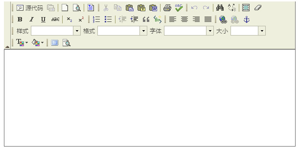

# 总体设计
## 结构框架介绍
## 整个系统操作介绍
## 数据库整体设计
### 数据字典
#### 用户信息表-user								

| 序号 | 字段名称      | 字段英文名       | 字段含义         | 数据类型    | P主键(Y/N) | U唯一(Y/N) | NULL(Y/N) | 备注                          |
| ---- | ------------- | ---------------- | ---------------- | ----------- | ---------- | ---------- | --------- | ----------------------------- |
| 1    | 用户编号      | id               | 该字段唯一标识   | int         | Y          | Y          | N         | 主键自增ID                    |
| 2    | 用户名        | account          | ~                | varchar(20) |            | Y          | N         | 英文开头，数字加英文组合(<20) |
| 3    | 用户密码      | password         | ~                | varchar(20) |            |            | N         | 更改后大于6位(<20)            |
| 4    | 用户昵称      | nickname         | ~                | varchar(20) |            |            | N         | 最多20字符                    |
| 5    | 用户Email地址 | email            | ~                | varchar(50) |            |            |           |                               |
| 6    | 用户头像      | photo            | 用户头像路径     | text        |            |            |           | 存储图片路径                  |
| 7    | 用户性别      | sex              | 男、女           | char(2)     |            |            |           |                               |
| 8    | 用户权限等级  | grade            | 会员、管理员判断 | int         |            |            | N         | 1为会员，2为管理员            |
| 9    | 用户注册日期  | registrationdate | 注册日期         | date        |            |            | N         |                               |
| 10   | 用户积分      | point            | 判断等级         | int         |            |            |           | 默认为50积分                  |
| 11   | 备用字段      | blank_1          | ~                | text        |            |            |           |                               |
| 12   | 备用字段2     | blank_2          | ~                | text        |            |            |           |                               |

#### 版块表-session

| 序号 | 字段名称  | 字段英文名  | 字段含义       | 数据类型    | P主键(Y/N) | U唯一(Y/N) | NULL(Y/N) | 备注                 |
| ---- | --------- | ----------- | -------------- | ----------- | ---------- | ---------- | --------- | -------------------- |
| 1    | 版块ID    | id          | 该字段唯一标识 | int         | Y          | Y          | N         | 主键自增ID           |
| 2    | 版块名字  | name        | ~              | varchar(50) |            |            | N         | 最高50字符           |
| 3    | 版主ID    | masterId    | ~              | int         | Y          |            | N         | 外键[引用用户表(id)] |
| 4    | 版块主题  | profile     | ~              | varchar(50) |            |            | N         | 最多50字符           |
| 5    | 发帖数    | topicCount  | ~              | int         |            |            |           |                      |
| 6    | 点击率    | clickCoount | ~              | int         |            |            |           |                      |
| 7    | 备用字段  | blank_1     | ~              | text        |            |            |           |                      |
| 8    | 备用字段2 | blank_2     | ~              | text        |            |            |           |                      |

#### 发帖表-topic

| 序号 | 字段名称     | 字段英文名     | 字段含义       | 数据类型    | P主键(Y/N) | U唯一(Y/N) | NULL(Y/N) | 备注                       |
| ---- | ------------ | -------------- | -------------- | ----------- | ---------- | ---------- | --------- | -------------------------- |
| 1    | 发帖ID       | id             | 该字段唯一标识 | int         | Y          | Y          | N         | 主键自增ID                 |
| 2    | 帖子所在版块 | sId            | ~              | int         | Y          |            | N         | 外键[引用版块表的ID(BSId)] |
| 3    | 发帖人       | uId            | ~              | int         | Y          |            | N         | 外键[引用用户表的ID(BUId)] |
| 4    | 回复数       | replyCount     | ~              | int         |            |            |           |                            |
| 5    | 标题         | topic          | ~              | varchar(50) |            |            | N         | 最多50字符                 |
| 6    | 正文         | contents       | ~              | text        |            |            | N         |                            |
| 7    | 发帖时间     | time           | ~              | datetime    |            |            | N         | YYYY-MM-DD HH:MM:SS        |
| 8    | 状态         | flag           | 0或1           | int         |            |            |           | 默认0,1代表置顶            |
| 9    | 点击量       | clickCount     | ~              | int         |            |            |           |                            |
| 10   | 最后回复用户 | lastReplyUseID | ~              | int         |            |            |           | 外键[引用用户表的ID(BUId)] |
| 11   | 最后回复时间 | lastReplayTime | ~              | datetime    |            |            |           | YYYY-MM-DD HH:MM:SS        |
| 12   | 备用字段     | blank_1        | ~              | text        |            |            |           |                            |
| 13   | 备用字段2    | blank_2        | ~              | text        |            |            |           |                            |

#### 跟帖表-reply

| 序号 | 字段名称   | 字段英文名 | 字段含义       | 数据类型 | P主键(Y/N) | U唯一(Y/N) | NULL(Y/N) | 备注                       |
| ---- | ---------- | ---------- | -------------- | -------- | ---------- | ---------- | --------- | -------------------------- |
| 1    | 跟帖ID     | id         | 该字段唯一标识 | int      | Y          | Y          | N         | 主键自增ID                 |
| 2    | 回复主贴ID | tId        | ~              | int      | Y          |            | N         | 外键[引用发帖表的ID(BTId)] |
| 3    | 发帖人ID   | uId        | ~              | int      | Y          |            | N         | 外键[引用用户表的ID(BUId)] |
| 4    | 回帖内容   | content    | ~              | text     |            |            | N         |                            |
| 5    | 回帖时间   | time       | ~              | datetime |            |            | N         | YYYY-MM-DD HH:MM:SS        |
| 6    | 备用字段   | blank_1    | ~              | text     |            |            |           |                            |
| 7    | 备用字段2  | blank_2    | ~              | text     |            |            |           |                            |
### 类图实现
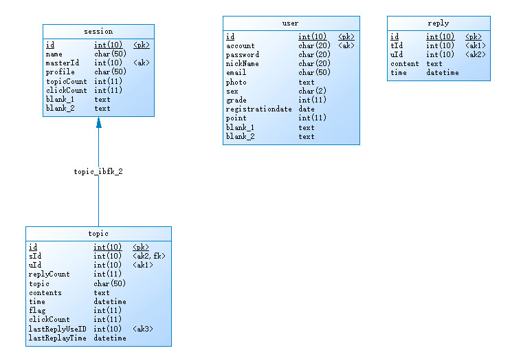

# 运行设计
## 项目结构说明
不采用框架（早期学期项目）jsp原生界面并采用servlet结合
- 项目结构图
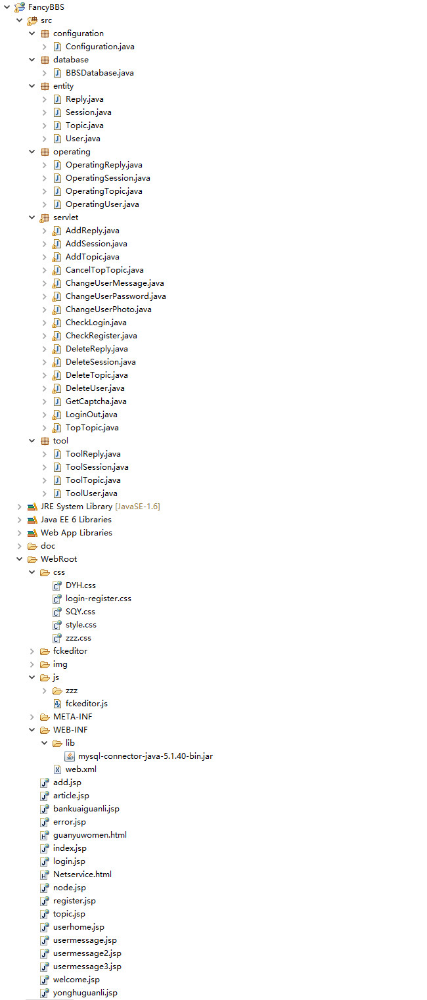
- 项目结构说明图
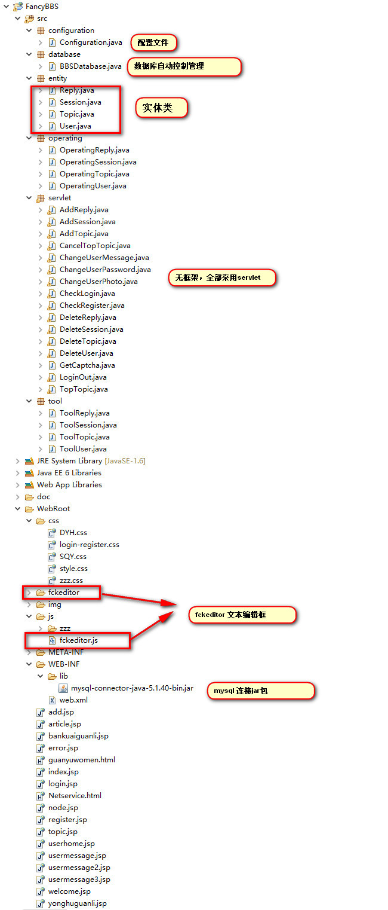
## 运行模块组合
- 主页
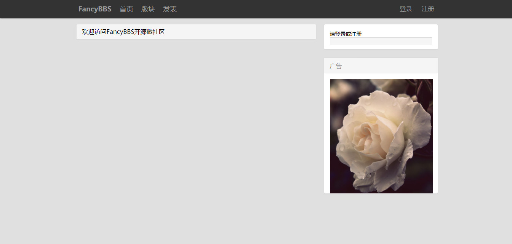
## 运行控制
### 注册以及会员登陆
- 登录
登录自动判断管理员与会员
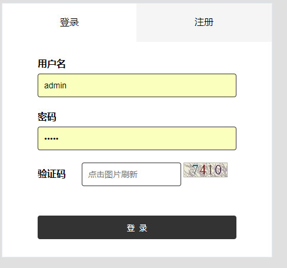
- 注册

### 发表帖子
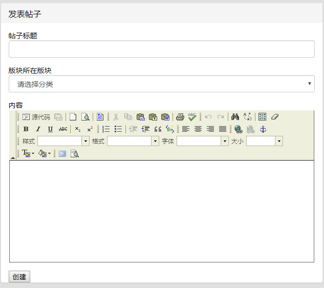
### 个人界面
- 个人设置
根据用户类型判断自动生成设置标签
`管理员设置`

`会员设置`

- 个人信息展示

- 个人信息修改
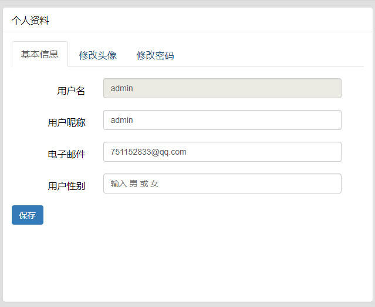
- 修改头像

- 修改密码
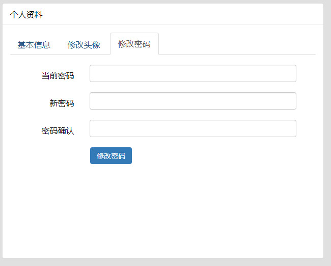
### 管理员
- 管理用户
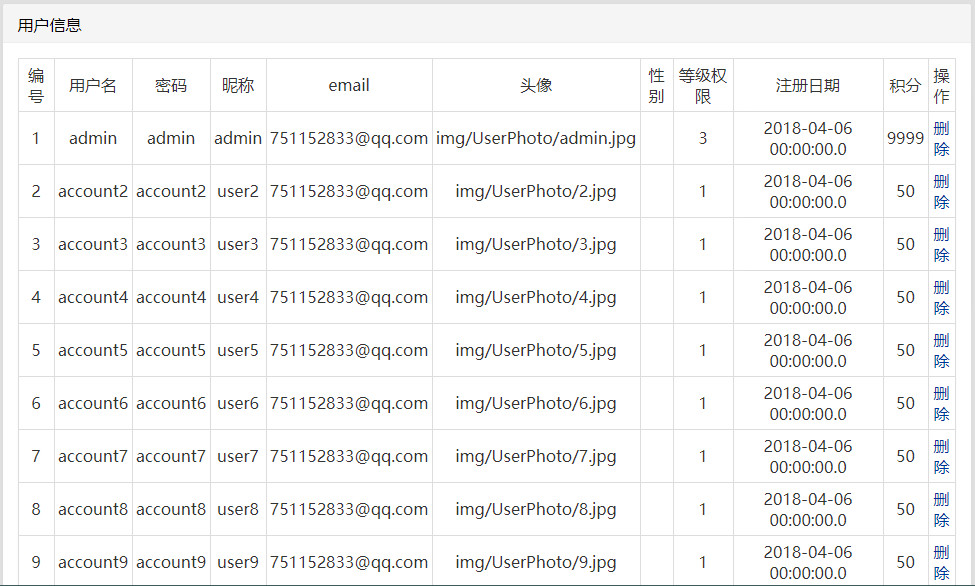
- 管理版块
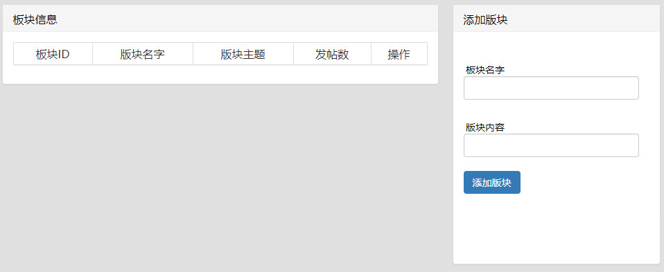